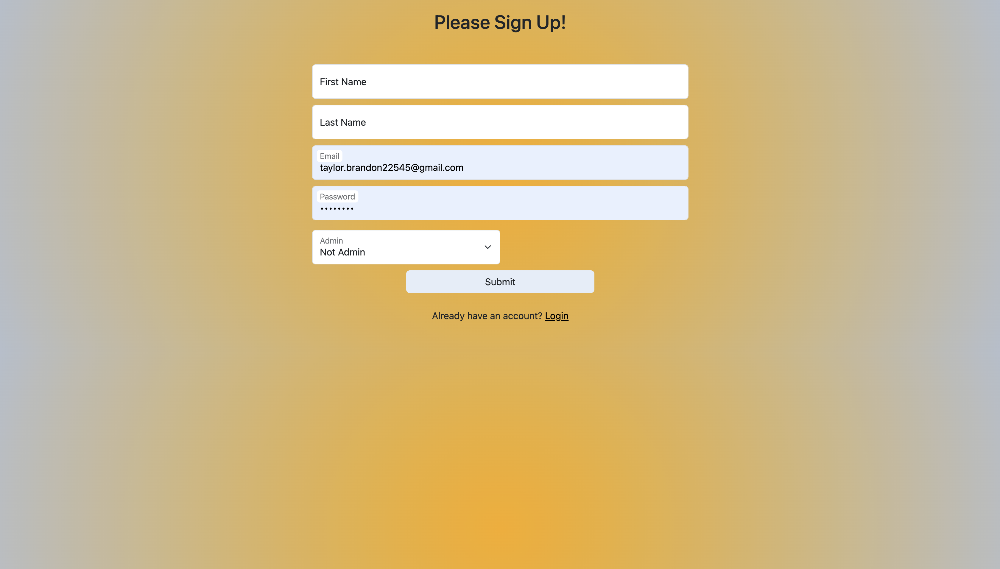
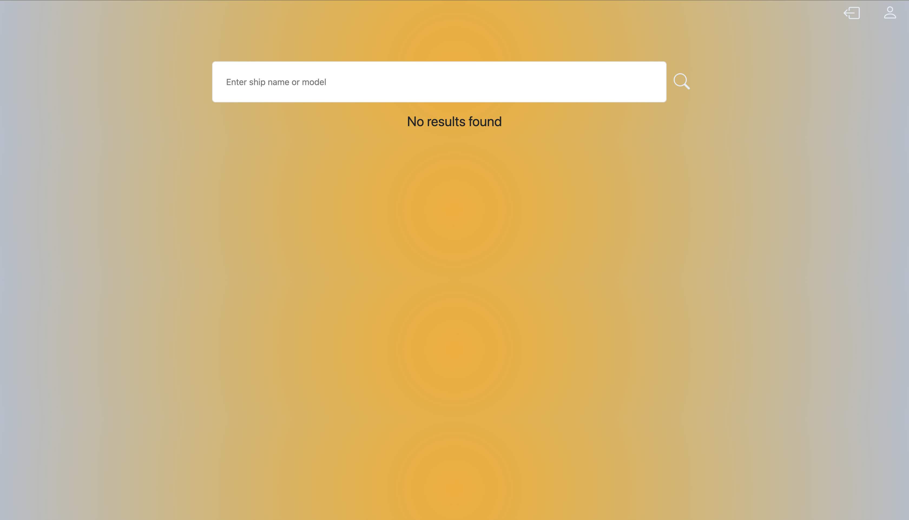
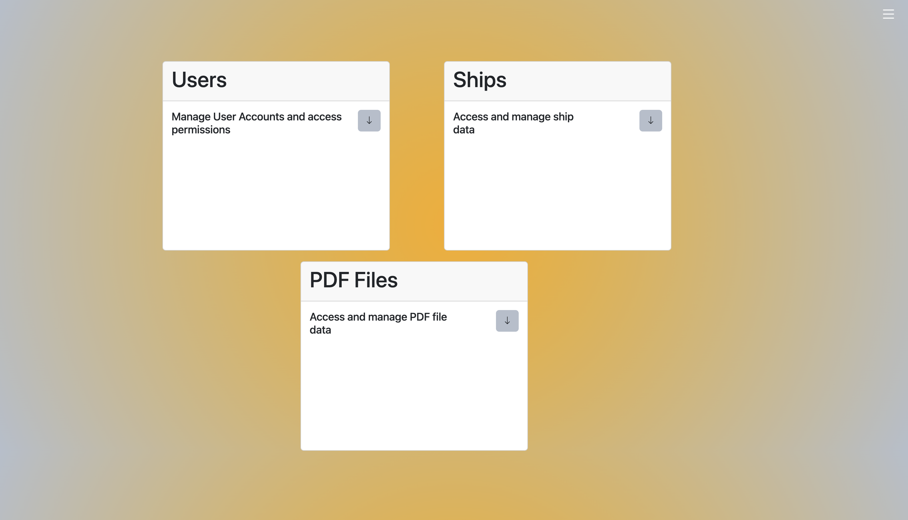

# Willard Marine Database

## Table of Contents

* [Introduction](#introduction)
* [Features](#features)
* [Installation](#installation)
* [Technologies Used](#technologies-used)
* [Usage](#usage)
* [Screenshots](#screenshots)
* [Future Developments](#future-developments)
* [Contact](#contact)
* [Contributions](#contributions)
* [License](#license)
* [Demo](#demo)

## Introduction

This is a React application that provides users with an efficient, searchable database to enhance their ability to access and manage ship data.

# Features

* User authentication to ensure data security.
* User-based roles, such as read-only and read-write, to further enhance data security.
* React library to improve maintainability and efficiency.
* Seamless PDF file addition and access to enhance the user experience when gathering data.
* RESTful API usage to ensure that admin users can update, add, and remove ship data.

## Technologies Used

* React Library
* Bootstrap Framework
* Bootstrap Icons
* Dotenv
* Express
* Node.js
* MongoDB

## Installtion

This project can be accessed locally by following these steps:

1. Clone the repository to your local machine.
2. Install the necessary dependencies by running npm install.
3. Seed database by running npm run seed.
4. Start the application by running npm run start in your terminal.

# Usage

* Sign in or log in by entering correct credentials.
* Identify the search bar after being redirected to the homepage.
* Search for a ship by ship name, model, HRN, HIN, contact number, five-year inspection certification, five-year inspection date, annual inspection date, sponson serial number, SRB serial number, fuel tank serial number, ZAPR356C2BVMX hook serial number, engine make and model, engine serial number, gear, gear serial number, jet, jet serial number, VolvoQ0087, POC name, POC phone number, and POC email.
* Click a result to navigate to an individual page that displays ship information.
* If ship data needs to be updated, and the user is an admin, fill out the form on the right side of the individual ship page to update the data.
* From the homepage, click the profile icon to see the profile page.
* The profile page contains three cards labeled Users, Ships, and PDF Files.
* If the user is not an admin, they can click the search icon on each card after clicking the arrow button to access data in the same way as the ship search component works.
* If the user is an admin, they may click the pen and plus icons to add or update data for each category.
* Fill out the appropriate form to add a user, ship, or PDF file.
* Complete the appropriate form to update a PDF file, user, or ship.
* When the user clicks the update icon, they should see a list of PDF files, ships, or users with a delete button to remove entries from the database.
* On the profile page, users should click the icon on the far right to see their profile information as well as links to log out or navigate to the homepage.
* Click the logout button on the homepage or profile page to log out.

## Screenshots

### Landing Page

### Homepage

### Profile Page

## Future Developments

* Add further conditional rendering to ensure greater security.
* Add more user based roles tto enhance user interactivity.
* Correct small styling errors for a greater user experience.
* Correct Ship addition form to ensure front-end addition of data.
* Correct ship update error to enhance functionality.
* Integrate Chart.js to enable visible data growth and statistics.

## Contact

If there are any questions or feedback, feel free to reach out via: 

* Github Issues: [Github](http://Github.com/Taylor-Brandon)

* Email: [Email](mailto://taylorbrandon.dev@gmail.com)

## License

## Demo

Access Demo 1: [Here](https://drive.google.com/file/d/1OyxxFNoVZ3tr1JlChGdKuLbQDnNvT2MR/view?usp=drive_link)

Access Demo 2: [Here](https://drive.google.com/file/d/16VyvPYzA3WqOv7TzmYj0Kz0Aux_3p43G/view?usp=drive_link)

